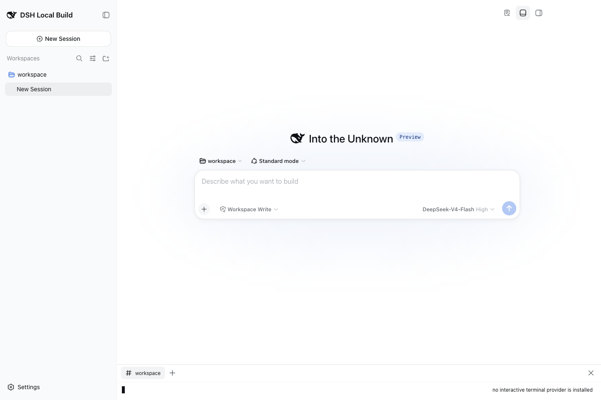

# Relay DSH Terminal 插件

> **现已支持 DSH `0.1.2-rc.1`，并保留对 `0.1.2-alpha.3` 的兼容。** 插件 `0.2.2` 已在两个版本上完成验证。[从 npm 安装](https://www.npmjs.com/package/relay-dsh-plugin-terminal) · [兼容性证据](https://github.com/yangbobo2021/Relay/tree/codex/relay-foundation/dsh-lab/dsh-0.1.2-rc.1-20260903)。

> **发布通道：** `latest` → `0.2.2`；`next` → `0.2.1-rc.1`。

```bash
npx @deepseek-ai/dsh@0.1.2-rc.1 plugin --profile web add relay-dsh-plugin-workbench@0.2.2 relay-dsh-plugin-terminal@0.2.2 relay-dsh-plugin-codex@0.2.2
npx @deepseek-ai/dsh@0.1.2-rc.1 web
```

[](https://www.npmjs.com/package/relay-dsh-plugin-terminal)
[](https://github.com/yangbobo2021/relay-dsh-plugin-terminal/actions/workflows/ci.yml)
[](https://www.npmjs.com/package/relay-dsh-plugin-terminal)
[](https://github.com/yangbobo2021/relay-dsh-plugin-terminal/stargazers)
[](LICENSE)
[](https://github.com/deepseek-ai/deepseek-harness)
[](.github/workflows/release.yml)

[English](README.md) | 中文

**npm 包名：** [`relay-dsh-plugin-terminal`](https://www.npmjs.com/package/relay-dsh-plugin-terminal)
· [全部 Relay DSH 插件](https://github.com/yangbobo2021/Relay/blob/codex/relay-foundation/docs/dsh-plugins.zh.md)

[](https://github.com/yangbobo2021/Relay/blob/codex/relay-foundation/docs/dsh-plugins.zh.md)

*演示来自官方 DSH 上的真实 npm 安装：Terminal 在对话下方启动工作区 Shell
并实际执行命令。[观看 H.264
MP4](https://github.com/yangbobo2021/Relay/blob/codex/relay-foundation/docs/media/dsh-plugin-suite-demo.mp4?raw=1)。*

`relay-dsh-plugin-terminal` 为官方
[DeepSeek Harness](https://github.com/deepseek-ai/deepseek-harness)（DSH）Web UI
增加基于 xterm 的底部终端面板。它提供浏览器终端界面、有边界的滚动输出缓存，
以及供执行后端注册的公开 provider 注册表。

这个插件使用 `relay-dsh-plugin-workbench` 作为面板宿主。请在同一个 DSH Profile
中安装 Workbench。



截图来自官方 DSH `0.1.1-rc.2`，安装了 Workbench、Files 和 Terminal。Terminal
可以在没有 provider 的情况下加载，并清楚提示 provider 不可用；如果需要真实交互
shell，请安装兼容后端。

## 我需要这个插件吗？

你需要这个插件的场景主要是：

- 想通过插件系统给官方 DSH Web 增加终端面板；
- 想配合兼容执行后端使用，例如 `relay-dsh-plugin-codex`；
- 想开发另一个通过公开 `ctx.relayTerminalProviders` 注册终端能力的后端插件。

Terminal 是 provider-neutral 的。只安装这个包时，DSH 可以加载终端面板，但在另一个
插件注册终端 provider 之前，无法启动真实交互 shell。

## 官方 DSH 快速开始

当前开发版本已验证：

- DeepSeek Harness `0.1.1-rc.2`，commit
  [`b150a551`](https://github.com/deepseek-ai/deepseek-harness/commit/b150a551b8d465e31e418e1b2eaf5e79bbb7d28e)
- Node.js 22.13 或更新版本
- `pnpm` 已在 `PATH` 中可用

DSH 仍是开发预览版本，后续可能出现不兼容变化。

### 1. 安装

修改 Profile 插件前，请先停止正在运行的 DSH Web。

#### GitHub 开发版本

如果你想测试尚未发布的最新开发代码，可以使用 GitHub 安装：

```bash
pnpm dlx @deepseek-ai/dsh@0.1.2-rc.1 plugin --profile web add github:yangbobo2021/relay-dsh-plugin-workbench#main github:yangbobo2021/relay-dsh-plugin-terminal#main
```

如果希望通过 Codex 使用交互终端，可以同时安装两个开发插件：

```bash
pnpm dlx @deepseek-ai/dsh@0.1.2-rc.1 plugin --profile web add github:yangbobo2021/relay-dsh-plugin-workbench#main github:yangbobo2021/relay-dsh-plugin-terminal#main github:yangbobo2021/relay-dsh-plugin-codex#main
```

如果希望可复现，请把每个 `#main` 都改成具体 Tag 或完整 commit SHA。这里显式列出
Workbench，是因为 DSH Profile 中的 pnpm 会阻止 GitHub 包作为传递依赖。

#### npm 正式版本

可以这样安装 npm 正式包：

```bash
pnpm dlx @deepseek-ai/dsh@0.1.2-rc.1 plugin --profile web add relay-dsh-plugin-workbench@latest relay-dsh-plugin-terminal@latest
```

如果希望配合已发布的 Codex 插件使用交互终端：

```bash
pnpm dlx @deepseek-ai/dsh@0.1.2-rc.1 plugin --profile web add relay-dsh-plugin-workbench@latest relay-dsh-plugin-terminal@latest relay-dsh-plugin-codex@next
```

### 2. 启动或重启 DSH Web

```bash
pnpm dlx @deepseek-ai/dsh@0.1.2-rc.1 web
```

如果你已经安装了 `dsh` 命令，也可以运行 `dsh web`。安装、更新或删除插件后都
需要重启 DSH Web。

### 3. 打开终端面板

在 DSH Web 中：

1. 打开终端中显示的 DSH 地址。
2. 如果 DSH 显示首次启动页面，先完成它。
3. 创建或选择一个带工作区目录的对话。
4. 打开 Workbench 底部面板，选择 `Terminal`。
5. 启动终端会话。

如果没有安装兼容终端 provider，面板会提示当前没有可用的交互终端 provider。

## 它提供什么？

- Workbench 底部面板中的 `Terminal` 视图
- 基于 xterm 的浏览器终端界面
- Host 侧有边界的滚动输出缓存
- 版本化的 `ctx.relayTerminalProviders` 注册表
- provider-neutral 的启动、输入、尺寸调整、输出和终止连接
- 与共享 Workbench 壳层组合使用

这个包本身不负责启动 shell。shell 执行能力由 provider 插件提供，目前包括 Relay
Codex DSH 插件。

### 手动终端权限

使用 Codex provider 时，每个手动终端会为其 Shell 显式请求
`sandboxPolicy: { type: "dangerFullAccess" }`，以支持普通 SSH 连接和用户文件写入。
这不会修改共享 Codex 后端配置，也不会改变 Agent 对话的沙箱或审批策略；不会获得
管理员权限或绕过操作系统权限。

访问终端等同于以 DSH 宿主用户身份执行命令，必须限制在可信且经过身份验证的访问
范围内；会话 ID 不是身份凭据。不要把此手动终端能力开放为 Agent 工具。如果
provider 拒绝该权限策略，终端启动失败，不会自动切换策略重试。

## 与 Relay 的关系

这个插件只负责终端展示和 provider 注册机制。它不依赖 Claude、Relay Events，也不
依赖任何私有 Relay 运行时。Codex 是可选 provider 插件，不是 Terminal 的硬依赖。

本仓库由 [Relay](https://github.com/yangbobo2021/Relay) 项目维护。Relay 探索
长时间运行的 Agent、外部事件投递、可复用 DSH Workbench 视图，以及多种对话后端。

## 更新、检查或删除

修改插件前先停止 DSH Web，完成后重新启动。

```bash
dsh plugin --profile web why relay-dsh-plugin-terminal
dsh plugin --profile web update relay-dsh-plugin-terminal
dsh plugin --profile web remove relay-dsh-plugin-terminal
```

如果是 GitHub 安装，`pnpm` 会在 DSH Profile 中记录来源。可以用 `why` 命令查看。

## 常见问题

### 看不到 Terminal 面板

安装插件后请重启 DSH Web，然后检查 Profile：

```bash
dsh plugin --profile web why relay-dsh-plugin-terminal
```

如果安装的是 GitHub `main`，可以尝试固定到一个已知 commit SHA。

### 面板提示没有交互终端 provider

这说明 Terminal 插件已经正确加载，但还没有后端插件注册 PTY provider。请安装兼容
provider，例如 `relay-dsh-plugin-codex`。

### 终端无法启动，提示没有工作区

请创建或选择一个带工作区目录的 DSH 对话。终端会话会在当前工作区中启动。

### 系统终端能连接，但这里 SSH 报 Operation not permitted

旧版插件没有指定 Shell 沙箱策略，会继承 Codex 后端的默认限制。请更新插件，
重启 DSH Web，再新建终端。已经启动的 Shell 不会自动获得新权限。如果更新后仍有
此错误，请检查宿主应用的操作系统网络权限和管理员配置的限制。

### 安装提示缺少 pnpm

请参考官方文档安装 pnpm：<https://pnpm.io/installation>。

## 开发

```bash
git clone https://github.com/yangbobo2021/relay-dsh-plugin-terminal.git
cd relay-dsh-plugin-terminal
npm install
DSH_ROOT=/path/to/deepseek-harness npm run verify
npm pack
```

`npm run verify` 会基于官方 DSH checkout 运行类型检查、测试和生产构建。

## 反馈

问题和需求可以提交到本仓库 issue：
<https://github.com/yangbobo2021/relay-dsh-plugin-terminal/issues>
